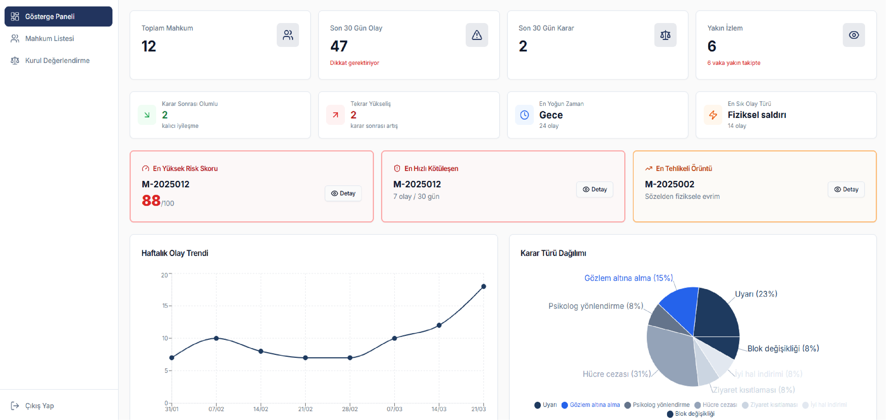
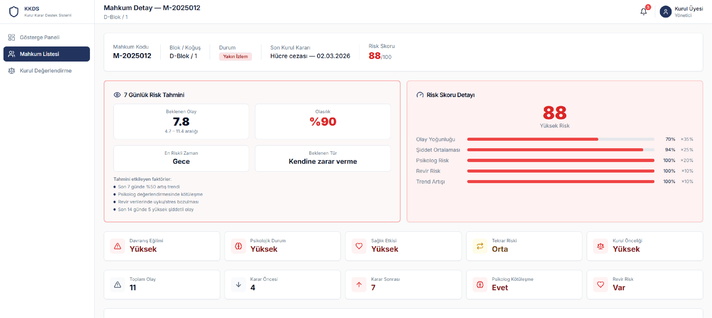
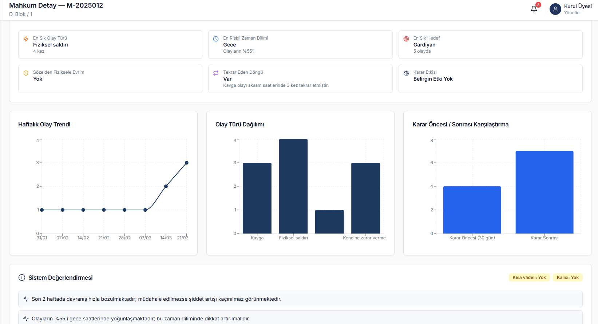
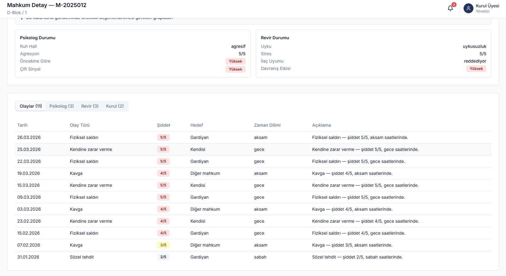
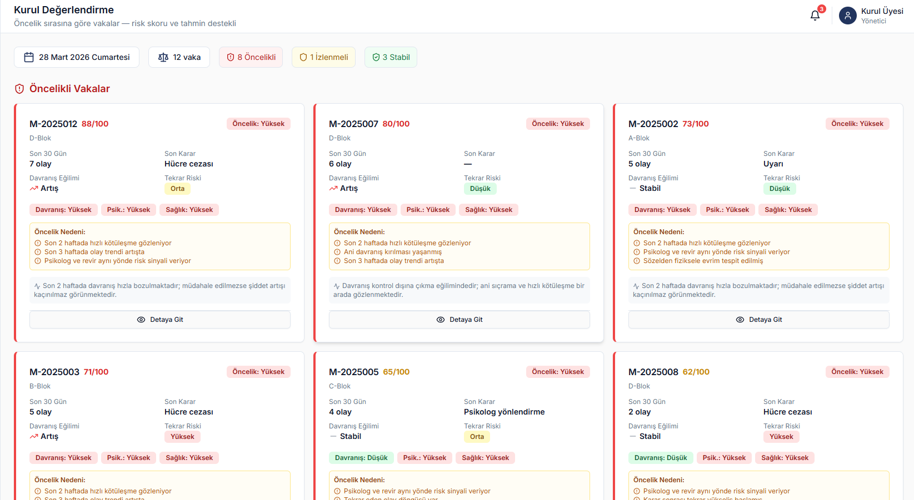
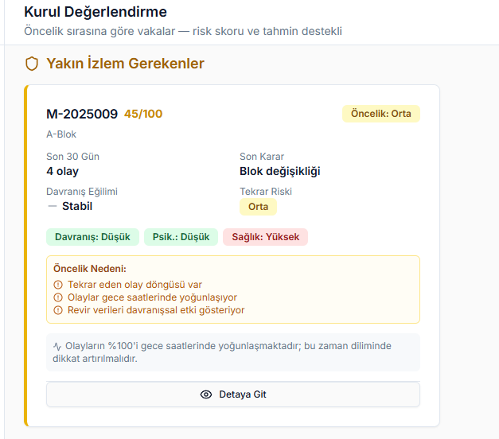
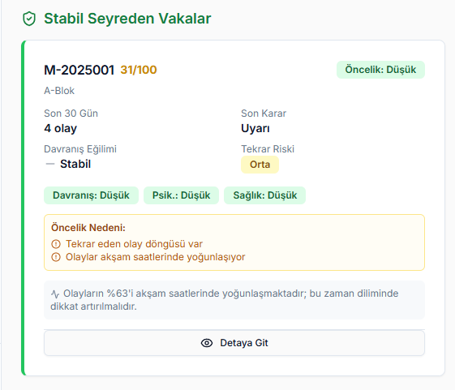

# KKDS — Kurul Karar Destek Sistemi

**KKDS**, yüksek güvenlik ve gizlilik gerektiren kurumsal ortamlardaki
değerlendirme süreçleri için tasarlanmış bağımsız bir masaüstü
**karar destek sistemi** çalışmasıdır.

Proje; farklı türdeki örnek kayıtların merkezi bir yapı altında
görüntülenmesi, ilişkilendirilmesi, analiz edilmesi ve karar vericiye
anlamlı özetler halinde sunulması yaklaşımını ele almaktadır.

> [!IMPORTANT]
> Bu repository bağımsız bir yazılım mühendisliği ve portföy çalışmasıdır.
> Herhangi bir kamu kurumunun resmî sistemini, gerçek iş süreçlerini,
> altyapısını, karar mekanizmalarını veya verilerini temsil etmez.

---

## 📸 Uygulama

### Ana Dashboard

Uygulamanın ana kontrol ekranı; sistemdeki farklı kayıt ve göstergelerin
tek noktadan takip edilebilmesi amacıyla tasarlanmıştır.

Kullanıcının detay ekranlarına geçmeden önce genel durumu hızlı biçimde
değerlendirebilmesini sağlayan özet bir görünüm sunar.



### Değerlendirme Dashboard'u

İkinci ana dashboard, kayıtların ve önemli göstergelerin farklı bir
perspektiften incelenmesini sağlayarak karar destek sürecini tamamlar.



---

## 🎯 Projenin Amacı

Kurumsal yapılarda farklı kategorilerde oluşturulan kayıtların zaman
içerisinde büyümesi, ihtiyaç duyulan bilgiye hızlı erişimi ve kayıtların
birbiriyle ilişkili şekilde değerlendirilmesini zorlaştırabilir.

KKDS bu problemi;

**Kayıt → İlişkilendirme → Analiz → Gösterge → İnsan Değerlendirmesi**

yaklaşımıyla ele almaktadır.

Sistemin amacı otomatik olarak karar vermek değil, mevcut veriyi
düzenleyerek ve anlamlandırarak kullanıcının değerlendirme sürecini
desteklemektir.

---

## 🧠 Karar Destek Yaklaşımı

KKDS'nin temel tasarım prensibi **insan merkezli karar destek** yaklaşımıdır.

Sistem farklı kaynaklardan oluşan kayıtları ortak bir görünüm altında
bir araya getirerek kullanıcının ihtiyaç duyduğu bilgiye daha hızlı
ulaşabilmesini amaçlar.

Bu kapsamda uygulama;

- farklı kayıt türlerini merkezi bir yapıda toplar,
- geçmiş kayıtların incelenmesini kolaylaştırır,
- ilişkili bilgilerin birlikte görüntülenmesini sağlar,
- önemli göstergelerin görünürlüğünü artırır,
- verileri görsel özetlerle destekler,
- değerlendirme sürecinde kullanıcıya yardımcı olur.

> [!NOTE]
> Sistem tarafından gösterilen bilgiler bir kararın kendisi değildir.
> Nihai değerlendirme her zaman yetkili kullanıcıya aittir.

---

## ⚠️ Erken Uyarı Yaklaşımı

Uygulamada, belirli kayıtlar arasında oluşabilecek dikkat çekici
durumların kullanıcı tarafından daha kolay fark edilmesine yardımcı
olan bir **erken uyarı yaklaşımı** bulunmaktadır.

Bu yapı otomatik karar üretmek yerine, çok sayıda kayıt arasında
gözden kaçabilecek durumları görünür hale getirmeyi amaçlamaktadır.

Public repository kapsamında gerçek kullanım senaryolarına ait
eşik değerleri, kurallar veya operasyonel parametreler paylaşılmamaktadır.

---

## 📊 Analiz ve Görselleştirme

Kayıtların yalnızca tablolar üzerinden görüntülenmesi yerine,
verilerin daha kolay yorumlanabilmesi için grafiksel ve özet
görünümlerden yararlanılmıştır.



Analiz ekranları, kullanıcının sistemdeki bilgileri daha hızlı
inceleyebilmesi ve genel görünümü değerlendirebilmesi amacıyla
tasarlanmıştır.

---

## 📋 Kayıt Yönetimi

Farklı türdeki kayıtların merkezi olarak görüntülenebilmesi ve
ilgili detaylara erişilebilmesi için kayıt yönetimi ekranları
oluşturulmuştur.



Bu yapı sayesinde uygulama içerisindeki bilgiler ortak bir kullanıcı
deneyimi üzerinden takip edilebilmektedir.

---

## 🔎 Olay ve Değerlendirme Görünümü

Kayıtların yalnızca bağımsız veriler olarak değil, gerektiğinde
ilişkili bilgilerle birlikte değerlendirilebilmesi amaçlanmıştır.



Bu yaklaşım, kullanıcının farklı ekranlar arasında kaybolmadan
ilgili bilgilere ulaşabilmesini hedeflemektedir.

---

## 🗂️ Detaylı Kayıt Görünümü

Kullanıcının seçilen bir kayda ilişkin bilgileri daha ayrıntılı
inceleyebilmesi için detay ekranları geliştirilmiştir.



Detay ekranlarında bilgi yoğunluğunun kontrollü tutulması ve önemli
alanların kolay fark edilebilir olması hedeflenmiştir.

---

## 🚑 Acil Durum Kayıt Modülü

Projede farklı kayıt türlerinin sisteme modüler olarak eklenebilmesini
göstermek amacıyla ayrı bir **acil durum kayıt modülü** de bulunmaktadır.



Bu modül, farklı bir kayıt alanının mevcut karar destek mimarisi
içerisinde nasıl yönetilebileceğini göstermektedir.

---

## ✨ Öne Çıkan Özellikler

- Yönetim ve değerlendirme dashboard'ları
- Merkezi kayıt yönetimi
- Kayıt detaylarının görüntülenmesi
- Arama ve filtreleme
- Grafiksel veri görselleştirme
- Erken uyarı yaklaşımı
- Farklı kayıt türlerinin ilişkilendirilmesi
- Geçmiş kayıtların incelenmesi
- Özet gösterge ve durum görünümleri
- Modüler kayıt yapısı
- Masaüstü kullanımına yönelik kullanıcı arayüzü
- İnsan merkezli karar destek yaklaşımı

---

## 🏗️ Sistem Yaklaşımı

KKDS yalnızca veri girişi yapılan bir kayıt uygulaması olarak değil,
farklı bilgileri bir araya getirerek değerlendirme sürecini destekleyen
bir sistem olarak ele alınmıştır.

```text
                  ┌────────────────────┐
                  │    Temel Kayıt     │
                  └─────────┬──────────┘
                            │
              ┌─────────────┼─────────────┐
              │             │             │
              ▼             ▼             ▼
        ┌───────────┐ ┌───────────┐ ┌───────────┐
        │ Kayıtlar  │ │ Olaylar   │ │ Ek Veriler│
        └─────┬─────┘ └─────┬─────┘ └─────┬─────┘
              │             │             │
              └─────────────┼─────────────┘
                            │
                            ▼
                  ┌────────────────────┐
                  │ Analiz & Özetleme  │
                  └─────────┬──────────┘
                            │
                            ▼
                  ┌────────────────────┐
                  │ Gösterge & Uyarılar│
                  └─────────┬──────────┘
                            │
                            ▼
                  ┌────────────────────┐
                  │ İnsan Değerlendirmesi │
                  └────────────────────┘
```

Bu yapının merkezinde **otomatik karar üretmek değil, doğru bilgiyi
doğru zamanda kullanıcıya sunmak** bulunmaktadır.

---

## 🔐 Güvenlik ve Gizlilik

Projenin ele aldığı alan gereği güvenlik ve veri gizliliği temel
tasarım kriterlerinden biri olarak kabul edilmiştir.

Kamuya açık bu repository özellikle portföy amacıyla hazırlanmıştır.

Repository içerisinde;

- gerçek kişi veya personel bilgileri,
- gerçek vaka ve olay kayıtları,
- kurum veya birim bilgileri,
- kurum içi prosedürler,
- gerçek karar kuralları,
- gerçek risk veya uyarı eşikleri,
- kurum içi ağ veya sistem mimarisi,
- IP adresleri,
- sunucu ve bağlantı bilgileri,
- kullanıcı adı veya parolalar,
- API anahtarları ve erişim bilgileri,
- kurum içi dokümanlar,
- gizli veya kişisel veriler

**bulundurulmaması esas alınmıştır.**

Public sürümde gösterilen arayüz ve içerikler, yazılımın tasarım
yaklaşımını göstermek amacıyla kullanılan **örnek/demo içeriklerdir.**

Ekranlarda gösterilen özellikler herhangi bir kurumun gerçek
operasyonel sürecinin, prosedürünün veya teknik altyapısının
birebir temsili olarak değerlendirilmemelidir.

---

## 💡 Geliştirme Yaklaşımı

KKDS, yüksek güvenlik gerektiren kurumsal ortamlarda karşılaşılabilecek
genel bilgi yönetimi ve değerlendirme ihtiyaçlarından hareketle
geliştirilmiş bir yazılım mühendisliği çalışmasıdır.

Geliştirme sürecinde yalnızca kullanıcı arayüzü oluşturulmasına değil;

- problemin analiz edilmesine,
- farklı veri türlerinin modellenmesine,
- bilgiye erişimin kolaylaştırılmasına,
- kullanıcı deneyiminin sadeleştirilmesine,
- kayıtların anlamlı biçimde ilişkilendirilmesine,
- verilerin görselleştirilmesine,
- karar destek yaklaşımının oluşturulmasına,
- güvenlik ve gizlilik gereksinimlerinin dikkate alınmasına

odaklanılmıştır.

Bu yönüyle proje, bir masaüstü arayüz çalışmasından ziyade
**gerçek dünya problemlerinin yazılım mühendisliği yaklaşımıyla
modellenmesine yönelik bir portföy çalışmasıdır.**

---

## 🚀 Geliştirilebilir Alanlar

Projenin mevcut yapısı gelecekte;

- rol tabanlı yetkilendirme,
- gelişmiş raporlama,
- denetim kayıtları (audit log),
- gelişmiş analiz ekranları,
- yapılandırılabilir uyarı mekanizmaları,
- anonimleştirilmiş istatistiksel analiz,
- daha kapsamlı veri görselleştirme,
- kontrollü ve yetkilendirilmiş sistem entegrasyonları

gibi özelliklerle genişletilebilir.

---

## ⚖️ Sorumluluk Reddi

**KKDS bağımsız bir yazılım mühendisliği ve portföy çalışmasıdır.**

Bu repository herhangi bir kamu kurumunun, kuruluşun veya idari
birimin resmî ürünü değildir.

Herhangi bir gerçek kurumun;

- iç işleyişini,
- güvenlik prosedürlerini,
- karar mekanizmalarını,
- teknik altyapısını,
- personel organizasyonunu,
- veri yapısını

açıklama veya temsil etme amacı taşımamaktadır.

Uygulamada gösterilen fonksiyonlar ve senaryolar yazılım geliştirme
çalışmasını göstermek amacıyla hazırlanmıştır.

---

## 👨‍💻 Geliştirici

**Atilla Mercimek**  
Yazılım Mühendisi

Bu repository, yazılım mühendisliği portföyüm kapsamında geliştirdiğim
bağımsız projelerden biridir.
